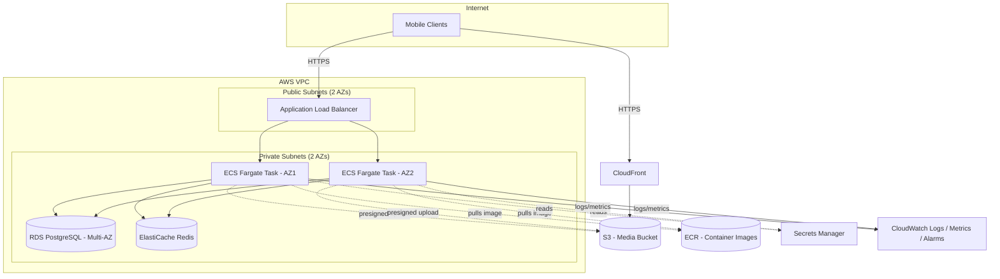

# Deployment

Infrastructure is defined as Terraform (see [ADR-0018](../adrs/0018-infrastructure-as-code-terraform.md)) in `infrastructure/`, with one composed environment per deployment target: `dev`, `staging`, `prod`.

## Deployment diagram

## Environments
| Environment | Purpose | Deploy trigger |
|---|---|---|
| `dev` | Shared integration environment for manual testing | Auto-deploy on merge to `main` |
| `staging` | Pre-prod, mirrors prod sizing at smaller scale | Auto-deploy on merge to `main` |
| `prod` | Production | Manual approval gate in GitHub Actions (see [ADR-0021](../adrs/0021-cicd-github-actions.md)) |

## Release process
1. PR merges to `main` after CI passes (unit, integration, contract tests — [ADR-0022](../adrs/0022-testing-strategy.md)).
2. CI builds the backend container image, pushes to ECR, tagged with the git SHA.
3. `terraform apply` runs for `dev`/`staging` automatically; DB migrations run as a pre-deploy step ([ADR-0009](../adrs/0009-schema-migrations.md)).
4. ECS performs a rolling deploy; the ALB health check gates traffic — a failing health check halts rollout automatically.
5. Promotion to `prod` requires manual approval in the GitHub Actions environment gate, then repeats steps 3-4 against the `prod` environment.

## Backups & disaster recovery
- **RDS**: automated daily snapshots, 7-day retention (raise as data value grows), Multi-AZ for automatic failover. Point-in-time recovery enabled.
- **S3 media bucket**: versioning enabled; lifecycle rule transitions old versions to cheaper storage classes rather than deleting, until a retention policy is explicitly decided.
- **Terraform state**: S3 backend with versioning + DynamoDB locking; state bucket itself is provisioned once, outside the normal environment-apply flow, and backed up like any other critical S3 bucket.
- **Full environment rebuild**: because all infrastructure is Terraform-defined ([ADR-0018](../adrs/0018-infrastructure-as-code-terraform.md)), a new environment (or a full account-level DR rebuild) is `terraform apply` against a fresh AWS account plus an RDS snapshot restore — this path should be tested periodically (game-day exercise), not assumed to work untested.

## Rollback
Rolling back a bad deploy: re-run the deploy workflow pinned to the previous known-good image tag in ECR; ECS performs the same rolling-deploy/health-check process in reverse. Database migrations are written to be backward-compatible within a release window (expand/contract pattern) specifically so a code rollback never requires a corresponding down-migration on a live database.
