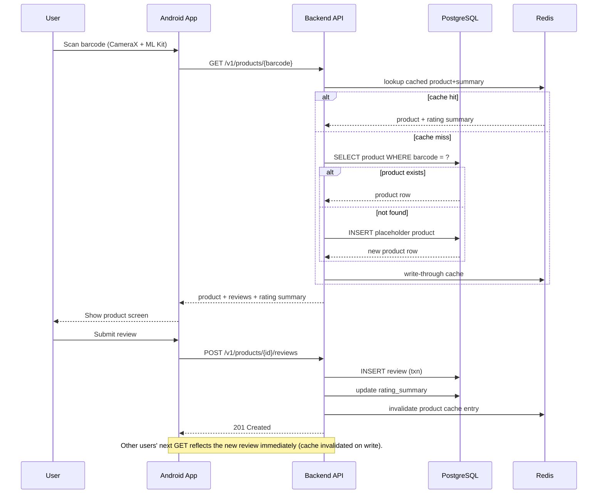
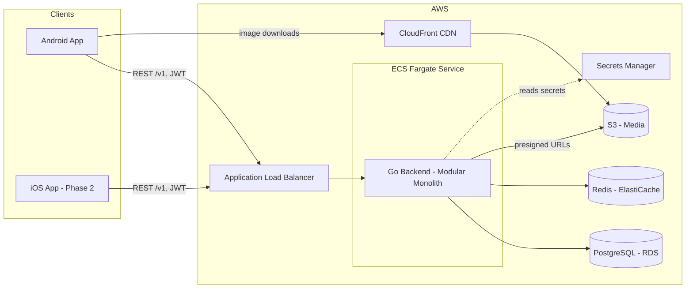
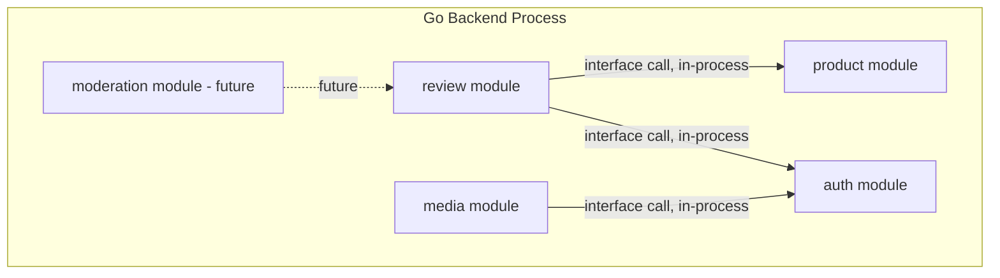

# System Overview

EveryReview lets a user scan a product's barcode and immediately see reviews other users have written about it. See the [ADRs](../adrs/README.md) for the reasoning behind every decision referenced here.

## Primary flow

## High-level architecture

## Backend module boundaries (modular monolith — see [ADR-0003](../adrs/0003-modular-monolith-backend.md))

Each module owns its own tables and exposes only Go interfaces to other modules — no cross-module SQL. This is what makes extracting a module into a standalone service later a contained refactor rather than a rewrite.

## Key documents
- [Database schema](database-schema.md)
- [API spec](../backend/api/openapi.yaml)
- [Deployment](deployment.md)
- [Development setup](development-setup.md)
- [Coding conventions](coding-conventions.md)
- [Contributing](contributing.md)
- [All ADRs](../adrs/README.md)
